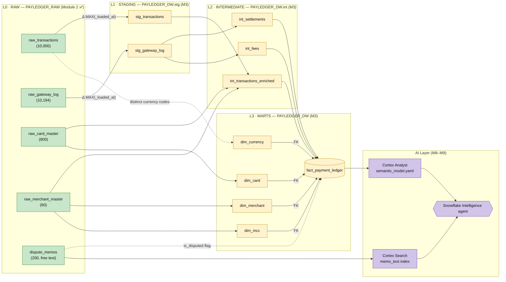

# PayLedger — Data Lineage

End-to-end lineage for the PayLedger pipeline: raw files → staging → intermediate →
fact + dimensions → AI layer.

> **Status:** Only **L0 (raw)** physically exists today (built in Module 2). Everything
> downstream is the planned shape from the course design — this doc is the map of where
> the raw tables are headed.

**Legend:** `Δ` = incremental load anchored on `MAX(_loaded_at)` · 🟢 built now (Module 2) ·
🟡 planned (built in the noted module) · `M3/M8/M9` = module that builds it · `FK` = foreign-key join.

---

## Diagram (Mermaid — renders on GitHub)



---

## Diagram (ASCII — for terminals / plain text)

```
L0 · RAW (M2 🟢)            L1 · STAGING (M3)        L2 · INTERMEDIATE (M3)            L3 · MARTS (M3)
PAYLEDGER_RAW              PAYLEDGER_DW.stg         PAYLEDGER_DW.int                  PAYLEDGER_DW
═════════════             ════════════════         ══════════════════                ═════════════

raw_transactions ──Δ──► stg_transactions ─┐
   (10,000)                                │
                                           ├─► int_transactions_enriched ─┐
raw_card_master ───────────────────────────┤      (+ card & merchant       │
   (800)                                    │         descriptive attrs)    │
                                            │                               ├─► fact_payment_ledger
raw_merchant_master ────────────────────────┘                              │      (1 row / settled txn)
   (60)                                                                     │
                                                                            │
raw_gateway_log ──Δ──► stg_gateway_log ─┬─► int_settlements ────────────────┤
   (10,194)                             │     (nets gateway retries)        │
                                        └─► int_fees ──────────────────────┘
                                              (interchange + scheme)

   Δ = incremental load anchored on MAX(_loaded_at)

CONFORMED DIMENSIONS (built straight from raw masters; fact joins on natural keys)
   raw_merchant_master ─► dim_merchant ─┐
   raw_merchant_master ─► dim_mcc       │
   raw_card_master     ─► dim_card      ├──◄ FK ──  fact_payment_ledger
   (currency codes)    ─► dim_currency ─┘

AI LAYER (M8–M9)
   fact_payment_ledger + dims ──► Cortex Analyst (M8) ──┐
                                  semantic_model.yaml    ├─► Snowflake Intelligence agent (M9)
   dispute_memos.memo_text ─────► Cortex Search (M9) ───┘    NL → metrics (Analyst) + reasons (Search)
```

---

## Column-level lineage — `fact_payment_ledger`

Grain: **one row per settled transaction.**

| Fact column | Source | Note |
|---|---|---|
| `payment_ledger_key` (PK) | `HASH(transaction_id)` | derived |
| `transaction_id` | `int_transactions_enriched.transaction_id` | |
| `transaction_ts` | `int_transactions_enriched.transaction_timestamp` | |
| `card_id` (FK → `dim_card`) | `int_transactions_enriched.card_id` | |
| `merchant_id` (FK → `dim_merchant`) | `int_transactions_enriched.merchant_id` | |
| `mcc_code` (FK → `dim_mcc`) | `int_transactions_enriched.mcc_code` | |
| `currency_code` (FK → `dim_currency`) | `int_transactions_enriched.currency_code` | |
| `transaction_type` | `int_transactions_enriched.transaction_type` | |
| `entry_mode` | `int_transactions_enriched.entry_mode` | |
| `auth_status` | `int_transactions_enriched.auth_status` | |
| `is_international` | `int_transactions_enriched.is_international` | |
| `gross_amount` | `int_transactions_enriched.amount` (signed by type) | derived |
| `settlement_amount` | `int_settlements.settlement_amount` | nets gateway retries |
| `interchange_fee` | `int_fees.interchange_fee` | |
| `scheme_fee` | `int_fees.scheme_fee` | |
| `net_amount` | `settlement_amount − interchange_fee − scheme_fee` | derived |
| `is_disputed` | `EXISTS` in `dispute_memos` (by `transaction_id`) | derived |
| `dw_load_timestamp` | `CURRENT_TIMESTAMP()` at load | audit |

---

*This is the target design. As each module is built, update the 🟡 nodes to 🟢 so the
diagram doubles as a course progress tracker.*
